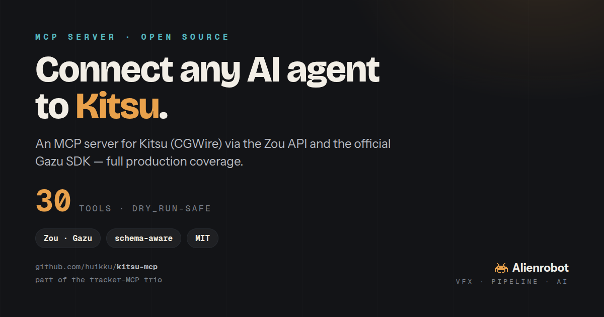

# Kitsu MCP server



A **Model Context Protocol** server that gives LLM agents (Claude Desktop, Claude Code, Cursor, …) access to
**[Kitsu](https://www.cg-wire.com/kitsu)** — CGWire's open-source production tracker — through its **Zou** API
and the official **[Gazu](https://github.com/cgwire/gazu)** SDK.

> **30 tools, one write family, a `dry_run` safety gate on every write.** Tested live against a self-hosted
> Kitsu — including **whole-project** ShotGrid ↔ Kitsu and ftrack → Kitsu migrations carrying structure +
> statuses + casting + thumbnails + **video version media (multiple versions)** + notes + **custom fields**,
> verified by read-back and torn down with `remove_project`.

Part of a small **tracker-MCP quintet** — see [Migrating projects between platforms](#migrating-projects-between-platforms).

## The 30 tools
**Generic power tools (full reach over the Zou REST API):**
- `get` — GET any Zou route (the escape hatch)
- `create` · `update` · `delete` — write to any Zou model collection
- `remove_project` — delete a project (Kitsu requires close→force; the generic `delete` can't)

**Media / versions (a "version" = a preview file on a task; thumbnails derive from previews):**
- `upload_preview` — upload an image/movie as a version on a task (+ optionally set the entity thumbnail)
- `download_preview` — pull a preview's media (image or movie) to disk
- `list_previews` — versions on a task
- `log_time` — log time on a task (the person must be assigned to it — a Kitsu rule)

**Schema & discovery (Kitsu is configurable — learn the site first):**
- `list_projects`
- `list_asset_types` · `list_task_types` · `list_task_statuses` (with workflow flags) · `list_departments`
- `list_metadata_descriptors` · `add_metadata_descriptor` · `set_metadata` — Kitsu's **schema-as-data** custom fields (`for_client` + per-department); define a field and set values (migration carries custom fields)

**Typed convenience (structure, creation + the review loop):**
- `list_assets` · `list_shots` · `list_sequences` · `list_tasks`
- `new_project` · `new_sequence` · `new_asset` · `new_shot` · `new_task` (entity-aware type resolution)
- `set_task_status` — post a comment that sets a task's status (the Kitsu review loop)
- `set_casting` — cast assets into a shot (breakdown)
- `project_summary` — a **normalized** project snapshot (counts + per-shot cast/status/thumbnail, canonical statuses) for cross-tracker verify/diff
- `whoami`

> The `new_*` + media + `set_casting` tools make Kitsu a viable **migration target** — read structure,
> statuses, casting, thumbnails and version media from another tracker (e.g. `shotgrid-mcp`) and recreate
> the project here. See [Migrating projects between platforms](#migrating-projects-between-platforms).

### Dry-run modes
Every write takes `dry_run` (default `false` = perform the write). `create` / `update` / `delete` /
`set_task_status` support **two preview levels**:
- **`dry_run="plan"`** (or `true`) — client-side echo of the intent. No server contact.
- **`dry_run="preflight"`** — a *real* dry run: resolves every reference against live data, validates
  (does the parent exist? is the status name valid?), returns a before→after diff for updates, and a
  `verdict` of `ok` / `would_fail` — **without writing anything**.

Set **`MCP_PLAN_LOG=/path/plan.jsonl`** and every plan/preflight is appended as a line, so a whole
dry-run migration produces a reviewable plan file. (Other write tools take `dry_run` as a plain boolean.)

## Install
```bash
pip install -r requirements.txt        # fastmcp, gazu
```

## Configure (credentials)
| var | value |
|---|---|
| `KITSU_URL` | your Kitsu API base, **including `/api`** — e.g. `https://your.kitsu.host/api` |
| `KITSU_EMAIL` | a Kitsu user (a **dedicated bot account** is recommended) |
| `KITSU_PASSWORD` | that user's password |

For local dev you can drop them in a `.env` next to `server.py` (gitignored — see `.env.example`).

## Run / wire into a client
```bash
python3 server.py        # stdio transport
```
Claude Code:
```bash
claude mcp add kitsu \
  -e KITSU_URL=https://your.kitsu.host/api \
  -e KITSU_EMAIL=bot@studio.com -e KITSU_PASSWORD=•••• \
  -- python3 /path/to/kitsu-mcp/server.py
```

## Examples (what the agent calls)
```python
get("data/projects")                                   # raw route, full reach
list_shots("<project_id>")                             # typed convenience
list_task_statuses()                                   # workflow-as-data (is_done/for_client/…)
new_asset("<project_id>", "Character", "Hero")         # asset-type name resolved for you
set_task_status("<task_id>", "wip", "Starting blocking")
create("shots", {"project_id":"…","name":"sh010"}, dry_run=True)   # preview, commit nothing
```

## Migrating projects between platforms
This is one of **four sibling tracker MCPs**, each exposing the **same shape** (generic CRUD + schema +
typed convenience, with a `dry_run` gate):

| Tracker | MCP |
|---|---|
| ShotGrid / Flow Production Tracking | [`huikku/shotgrid-mcp`](https://github.com/huikku/shotgrid-mcp) |
| ftrack Studio | [`huikku/ftrack-mcp`](https://github.com/huikku/ftrack-mcp) |
| **Kitsu (CGWire)** | this repo |
| AYON (Ynput) | [`huikku/ayon-mcp`](https://github.com/huikku/ayon-mcp) |
| NIM (NIM Labs) | [`huikku/nim-mcp`](https://github.com/huikku/nim-mcp) |

📊 **See [`COMPARISON.md`](COMPARISON.md)** for a side-by-side of the five trackers (data model, status
vocabularies) and the **migration incompatibilities** to know about (casting can't round-trip through
ftrack; statuses must be mapped; Kitsu projects need `remove_project` to delete; heavy publish *bytes* stay
on storage — only references carry).

🧪 **See [`TESTING.md`](TESTING.md)** for how these servers are validated — live round-trip tests, two-level
dry-run checks, and the cross-tracker migration matrix (including what is *not* yet covered, stated plainly).

Because all four speak the same production model (Project → Sequence/Asset → Shot → Task → Version/Status)
and present a uniform tool surface, **an agent with two of them loaded can migrate a project from one
platform to another** — read the structure from the source tracker, map the schema, and recreate it in the
target:

> *"Read every sequence, asset, shot and task from the ShotGrid project, then recreate them in Kitsu."*

The agent calls `find`/`list_*` on the source MCP and `create`/`new_*` on the target — no bespoke migration
script. (This trio grew out of exactly that exercise: a single project copied across ShotGrid, ftrack and
Kitsu to prove the tracker-agnostic, agent-native approach.)

## Credits
- **[Kitsu, Zou & Gazu](https://github.com/cgwire)** by **CGWire** — the open-source tracker, its API, and
  the Python SDK this is built on. Please support and star them.
- Companion to **[`shotgrid-mcp`](https://github.com/huikku/shotgrid-mcp)** and
  **[`ftrack-mcp`](https://github.com/huikku/ftrack-mcp)**.

MIT licensed.

---

Built by **John Huikku** · [alienrobot.com](https://alienrobot.com)
